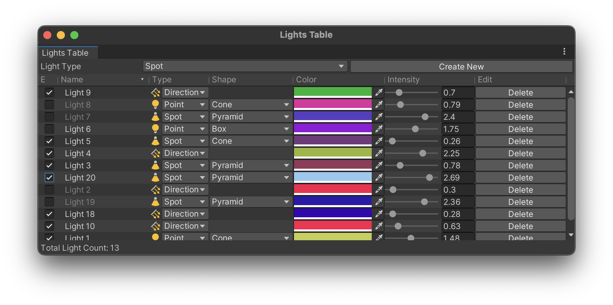

# SimpleEditorTableView

## Introduction
SimpleEditorTableView provides a simple way to create a TableView in Unity Editor GUI. It encapsulates Unity's MultiColumnHeader and ScrollView, but with a simpler and more direct interface, supporting click sorting and custom element rendering.

For a complete Demo, see [DemoWindow.cs](DemoWindow.cs)



## Getting Started

### Step 1: Create an Editor Class

1. Place `SimpleEditorTableView.cs` in the Editor directory.
2. Define a data structure to store the data in the TableView.
3. Create a new EditorWindow or Editor class.
4. Add a member of the `SimpleEditorTableView<TData>` class in your Editor class.

    ```csharp
        public class LightItem
        {
            public bool enabled;
            public string name;
            public LightType type;
            public LightShape shape;
            public Color color;
            public float intensity;
        }
    
    
        public class MyEditor : EditorWindow
        {
            private SimpleEditorTableView<LightItem> _tableView;
        }
    ```

### Step 2: Define the Table Structure

Call the `SimpleEditorTableView<TData>.AddColumn()` method to define the columns in the TableView. The caller decides how to draw each element, including various properties, how to sort, etc.

 ```csharp
      private void CreateTable()
      {
          _tableView = new SimpleEditorTableView<LightItem>();

          // first column is a toggle, with a minimum width of 50 and a maximum width of 80
          _tableView.AddColumn("Enabled", 50, (rect, item) =>
          {
              item.enabled = EditorGUI.Toggle(rect, item.enabled);
          }).SetMaxWidth(80);

          // second column is a text field, can be sorted by name
          _tableView.AddColumn("Name", 100, (rect, item) =>
          {
              item.name = EditorGUI.TextField(rect, item.name);
          }).SetMaxWidth(200).SetSorting((a, b) => a.name.CompareTo(b.name, StringComparison.Ordinal));

          // define more columns here
          // ...
     }
 ```

* For the AddColumn method, the following parameters are required:
    - __title__: The title of the column.
    - __minWidth__: The minimum width of the column.
    - __onDrawItem__: A delegate for drawing the controls for each element. It accepts two parameters, one is Rect, which represents the position and size of the control, and the other is TData, which represents the data of the current element.

* The return value of AddColumn can be chained:
    - __SetMaxWidth__: Sets the maximum width of the column.
    - __SetTooltip__: Sets the tooltip for the column.
    - __SetAutoResize__: Sets whether the column should automatically resize.
    - __SetAllowToggleVisibility__: Sets whether the column can be hidden.
    - __SetSorting__: Sets the sorting rule. Pass in a comparator to compare the size of two elements. Only ascending order sorting needs to be implemented; descending order sorting will be handled automatically.

### Step 3: Call Drawing in OnGUI
Call the `SimpleEditorTableView<TData>.DrawTableGUI()` method in OnGUI to set the data. A TData array needs to be passed in. It can be inserted anywhere in OnGUI.

 ```csharp
     private LightItem[] _lightItems = new LightItem[] {
         // ...
     }; 
     
     private void OnGUI()
     {
         // Draw some GUI here
         _tableView.DrawTableGUI(_lightItems);
         // Draw more GUI here
     }
 ```